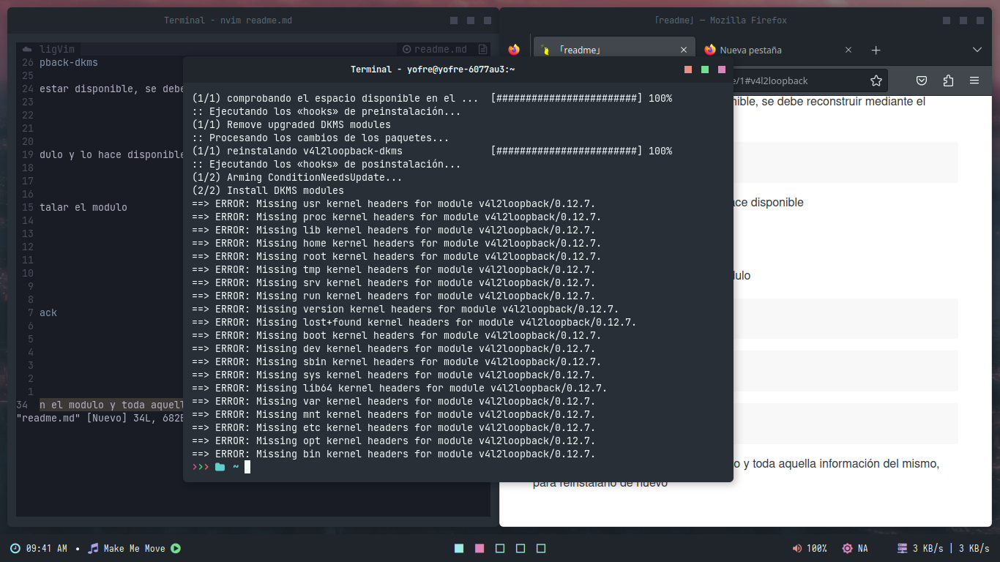

### v4l2loopback

Errores en cuanto a su instalación, modulo no encontrado o disponible

1) Principalmente asegurarse de que el paquete exista

    ```sh
    sudo pacman -S v4l2loopback-dkms
    ```
2) Si el modulo sigue sin estar disponible, se debe reconstruir mediante el siguiente comando:

    ```
    sudo dkms autoinstall
    ```
    Esto reconstruye el modulo y lo hace disponible

### ¿El problema persiste?

En este caso se debe reinstalar el modulo

```sh
sudo rmmod v4l2loopback
```


```sh
sudo modprobe -r v4l2loopback
```

```sh
sudo modprobe v4l2loopback
```

Estos comandos desintalaran el modulo y toda aquella información del mismo, para reinstalarlo de nuevo

### ¿Problemas con Linux headers?



```sh
sudo  pacman -S linux-headers
```

<hr>

##### ¿error: no se pudo obtener el archivo «linux-headers-6.1.12.arch1-1-x86_64.pkg.tar.zst» desde mirror.csclub.uwaterloo.ca: The requested URL returned error: 404?

Es posible que el espejo no tenga el archivo más reciente o haya problemas con la conexión de red. Puede intentar actualizar su lista de espejos y buscar un espejo alternativo ejecutando el siguiente comando en la terminal:

```sh
sudo pacman -Syyu
```

Intente nuevamente el siguiente comando

```sh
sudo pacman -S linux-headers
```
 Reiniciar el equipo
